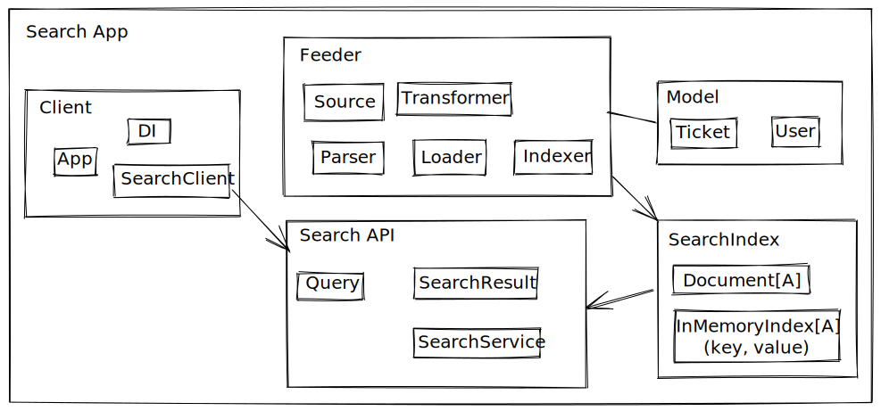

# search-app

Simple in memory search application built using Scala and Functional Programming.

## Design



### Modules

The application is composed of the following modules (as shown in picture above):

 - **Model**: Data structures modelling the entities for the domain of this search app.
 - **Feeder**: holds all components related to feeding a search index with data. Traditional items for extracting,
   transforming and loading the data live here.
 - **SearchIndex**: Referred simply as "Index". This module holds components that are concerned with the definition of
   the different search indices for this application, their structure, that of their documents and their management.
 - **Search API**: Holds all the components in charge of performing searches against the search indices. Elements such
   as query parsing, search query definition and search execution exist here.
 - **Client**: Simple console/command line search client.

### Query Design

Query DSL:

```
from:entity filter filter filter
```

where filter is composed of a `field` an `=` symbol, an `operator` and a `filter value`, for example:

```
id==an-id type==a-type subject=%a-sample-project% tags=[tag1,tag2]
```

valid operators are

 - `=`: a field equals exactly a value (effort is done to ignore case)
 - `%`: a field is LIKE a value, i.e the field contains the filter value within its value (fiter value should be
   followed by a closing `%` symbol)
 - `[]`: a field is within any of the elements given within the brackets (currently not supported)

### Index Design and Search Performance

It is assumed that search data can fit within the available server memory, but some other restrictions are enforced:

 - index data store would be optimised for memory usage.
 - search documents besides from been read, could be added, updated or removed.
 - data should be fed avoiding memory overbooking, i.e. assume memory is limited and that we could run into out of memory
  errors if feeding is not memory optimised.
 - documents could be fed in parallel
 - batch feeding is not supported (documents are indexed one at a time).

Given the considerations above Scala's `mutable.HashMap` has been selected due to its performance been considered as
[constant time](https://docs.scala-lang.org/overviews/collections/performance-characteristics.html) (with some assumptions)
and because it allows a document (value) been recognised by its id (key).

#### Other Search Index considerations

Given the divergent structure of the different entities a decision has been made to have each of them live within its
own index.

As a consequence, there is the need to make an extra call per record to bring across the related data from one entity
to the other per search result. A possible mitigation/workaround for this is the creation of a third index holding 
references to the other two entities in a "fat" style (but without the need of extra memory allocation). This approach
has been discarded to favour simplicity and reduced development time.

## Programming Principles and Choices

 - Use the [cats](https://typelevel.org/cats/) library for functional constructs and data types.
 - Use [cats-effect](https://typelevel.org/cats-effect/) library for managing effects and execution.
 - Use [fs2](https://fs2.io/#/) for feeding data as streams for high performance and low resource consumption.
 - Prefer immutability (with the exception of search index being mutable, as explained in the previous section)
 - Prefer the tagless final encoding for adopting the principle of least knowledge/power.
 - Use dependencies as functions: that is, DI is implemented by defining/passing dependencies as functions (checked at
   compile time).
 - Use the type system as much as possible to prevent invalid states or incorrect values been passed around (ADTs,
   newtypes and the like are used everywhere).
 - Use an ADT to represent application errors.
 - Use [circe](https://circe.github.io/circe/) as json decoding library.
 - Use parser combinators for query parsing. See [atto](https://tpolecat.github.io/atto/) library
 - Use cats `Show` typeclass to represent data types as Strings to print in the client console.

## Requirements

- sbt 1.5.x (implemented/tested with sbt 1.5.4)
- Java Development Kit 11 (implemented/tested with AdoptOpenJDK Java 11.0.10)

## Usage

```
sbt run
```

### Running queries

Console application is simple and search query can sometimes be misinterpreted or misread by the environment. However, it
is perfectly functional. To run a search simply enter a query according to the DSL described above or type `help` for
some usage documentation and query samples.

Some sample queries:

- Find un-verified users:

```
from:users verified==false
```

- Find unassigned tickets for the "incident" type

```
from:tickets unassigned type==incident
```

Search results are not limited by default, however this can be overridden to 10 results per search (or any other
arbitrary limit) by running:

```
MAX_SEARCH_RESULTS=10 sbt run
```

The index data is loaded at startup from the `data` folder. Custom source files can be indicated by pointing to their
full path by using the environment variables `USERS_JSON` and `TICKETS_JSON`:

```
USERS_JSON=/tmp/my-users.json TICKETS_JSON=/tmp/my-tickets.json sbt run
```

Finally, to exit just press `Ctrl+C`.

## Limitations and known issues

- The test `IndexManagerSpec` has been seen failing once. No repoduction has been possible and no more time has been
  available for further investigation (a 50 millisecond delay has been as a workaround before checking indexing result).
- tags filter is currently not supported, nor the values in operator `[]`.
- no ability to scroll trough past queries.
- Query Filters can be improved by enforcing their search target. This however has not been implemented due to time
  restrictions.

## Final Words

A good deal of exploratory testing has been done to the console client and the search capabilities, however the testing
cannot be considered thorough and has not been documented. Lastly, there's a good deal of unit and integration testing
done to the code, however many more could be added.

I hope you have fun reading the code and if you have any questions please feel free to DM me to @frequeno in Twitter or
email me to frequeno@gmail.com
